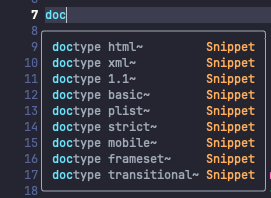
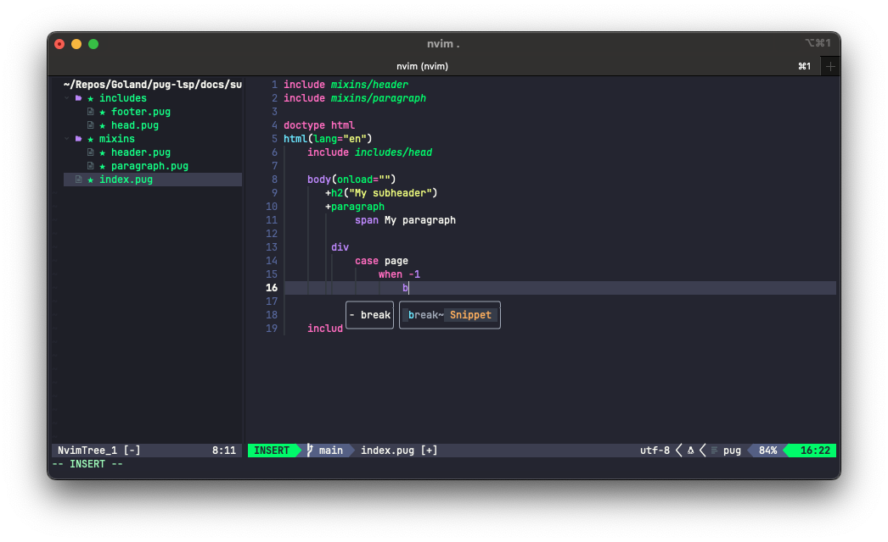
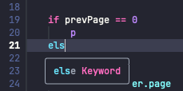

# pug-lsp: Pug Language Protocol Server

An implementation of the Language Protocol Server for [Pug.js](https://pugjs.org)

## Features

`pug-lsp` aims to provide suggestions for you to edit `.pug` in your editor.

### Note

Project is under heavy development. Current functionality can be change in stable release.

### Tags suggestions

Auto suggest list of HTML5 tags.

### Attributes suggestions

#### Auto suggest common attributes (such as `style`, `class`, `title`) for tags

#### Auto suggest events (such as `onclick`, `onenter`) for tags

#### Auto suggest tag-specific attributes (such as `href` for `a`)

#### `&attributes` snippet

_Yes, it's [a real feature](https://pugjs.org/language/attributes.html#attributes) of Pug_

### `Doctype` suggestions

PugJS has [a pre-defined list](https://pugjs.org/language/doctype.html) of possible doctypes. 

### Keywords suggestions

#### `case .. when .. default`

Pug-LSP simply follows [Pug's implementation](https://pugjs.org/language/case.html)

_Note_ [Case Fall Through](https://pugjs.org/language/case.html#case-fall-through)

> You can use fall through, just as you would in a JavaScript switch statement.
>
> The difference, however, is a fall through in JavaScript happens whenever a break statement is not explicitly included; 
> in Pug, it only happens when a block is completely missing.

If you would like to not output anything in a specific case, add an explicit unbuffered break

#### `if .. else`

## Thanks

 - [zealot128/tree-sitter-pug](https://github.com/zealot128/tree-sitter-pug)

----

