# pug-lsp: Pug Language Protocol Server

An implementation of the Language Protocol Server for [Pug.js](https://pugjs.org)

<!-- toc -->

- [Installation](#installation)
  * [Neovim](#neovim)
  * [Manually](#manually)
- [Features](#features)
  * [Note](#note)
  * [Freestyle](#freestyle)
  * [Tags suggestions](#tags-suggestions)
  * [Attributes suggestions](#attributes-suggestions)
    + [Auto suggest common attributes (such as `style`, `class`, `title`) for tags](#auto-suggest-common-attributes-such-as-style-class-title-for-tags)
    + [Auto suggest events (such as `onclick`, `onenter`) for tags](#auto-suggest-events-such-as-onclick-onenter-for-tags)
    + [Auto suggest tag-specific attributes (such as `href` for `a`)](#auto-suggest-tag-specific-attributes-such-as-href-for-a)
    + [`&attributes` snippet](#attributes-snippet)
  * [Mixins suggestions](#mixins-suggestions)
  * [`Doctype` suggestions](#doctype-suggestions)
  * [Keywords suggestions](#keywords-suggestions)
    + [`case .. when .. default`](#case--when--default)
    + [`if .. else`](#if--else)
  * [Hover reference](#hover-reference)
  * [Diagnostics](#diagnostics)
    + [Include](#include)
    + [Mixins](#mixins)
- [Thanks](#thanks)

<!-- tocstop -->

## Installation

### Neovim

1. Search for `pug` in [mason.nvim](https://github.com/williamboman/mason.nvim)
2. Setup using [nvim-lspconfig](https://github.com/neovim/nvim-lspconfig):

```lua
require("lspconfig").pug.setup({})
```

### Manually

Pug-LSP can be installed via 
```bash
go get github.com/opa-oz/pug-lsp
``` 

or manually downloaded from [releases page](https://github.com/opa-oz/pug-lsp/releases)


## Features

`pug-lsp` aims to provide suggestions for you to edit `.pug` in your editor.

### Note

Project is under heavy development. Current functionality can be change in stable release.

### Freestyle


_Yes, go-to-definition supported_


### Tags suggestions

Auto suggest list of HTML5 tags.

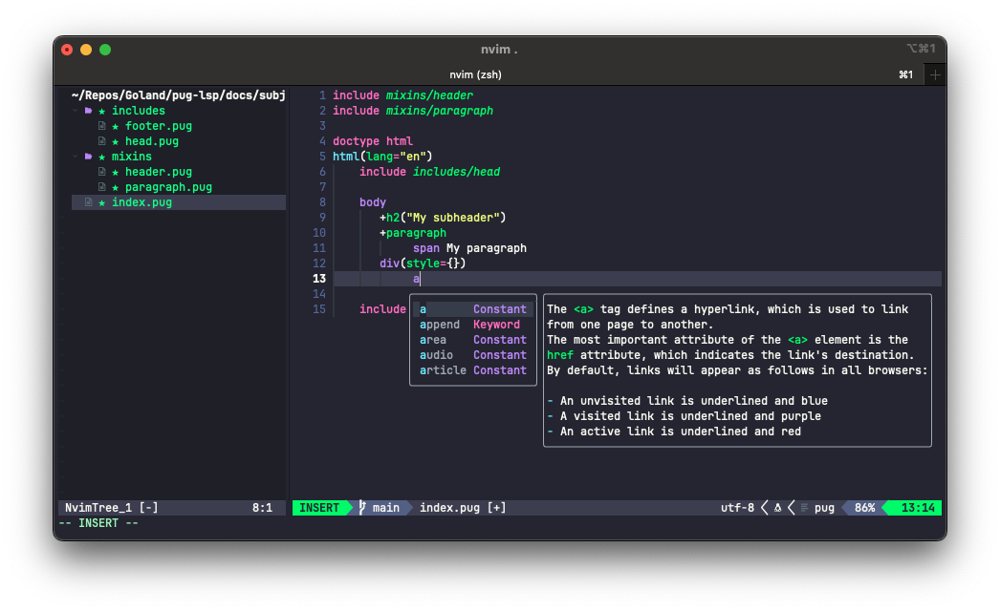

### Attributes suggestions

#### Auto suggest common attributes (such as `style`, `class`, `title`) for tags

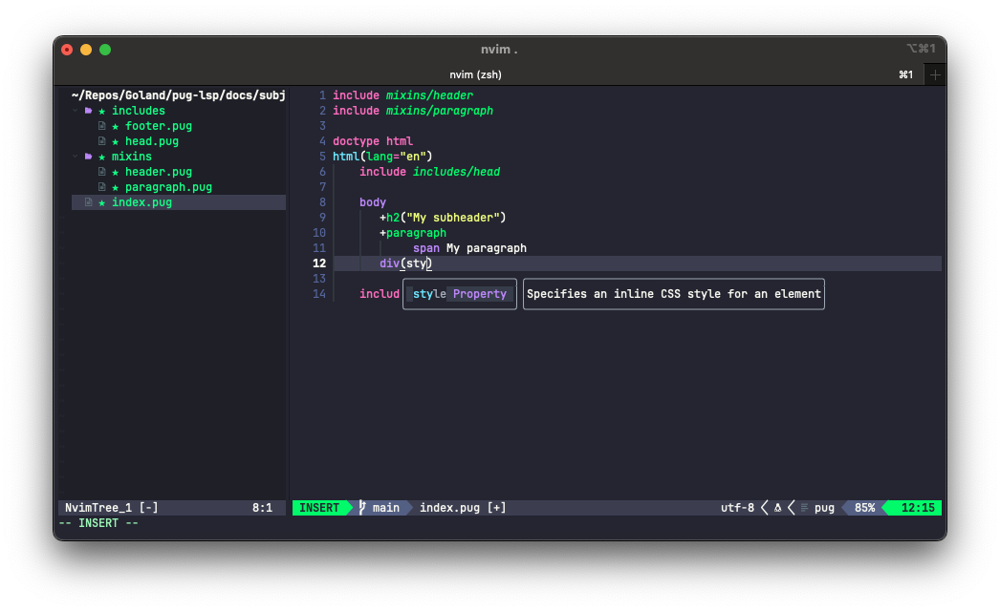

#### Auto suggest events (such as `onclick`, `onenter`) for tags

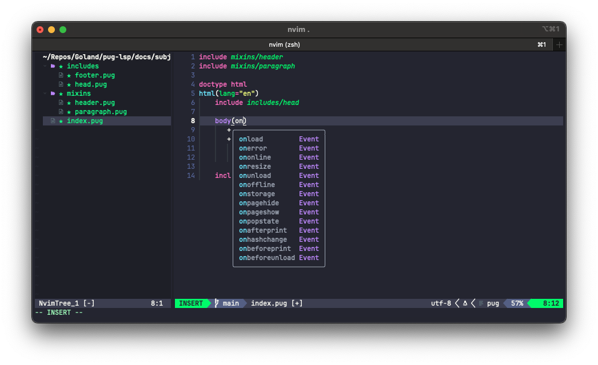

#### Auto suggest tag-specific attributes (such as `href` for `a`)

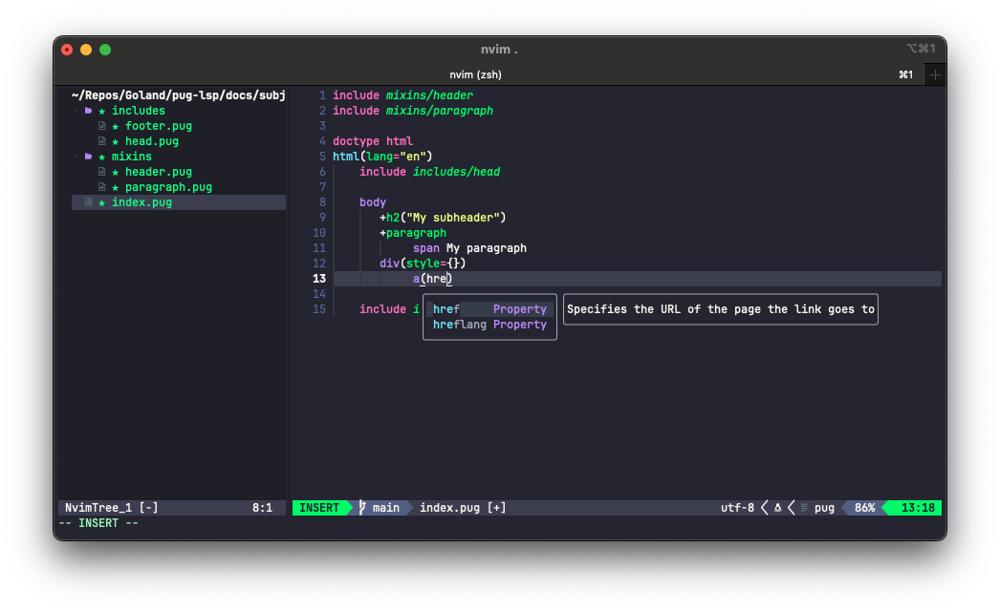

#### `&attributes` snippet

_Yes, it's [a real feature](https://pugjs.org/language/attributes.html#attributes) of Pug_

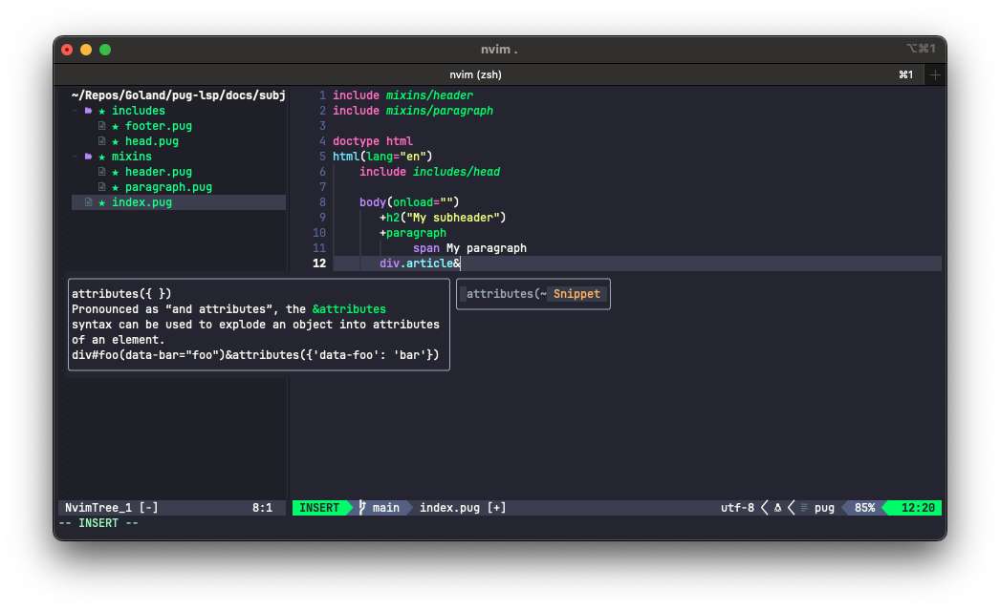

### Mixins suggestions

Look through included files and suggest defined mixins!

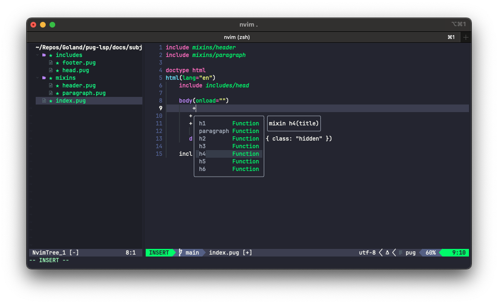


### `Doctype` suggestions

PugJS has [a pre-defined list](https://pugjs.org/language/doctype.html) of possible doctypes. 

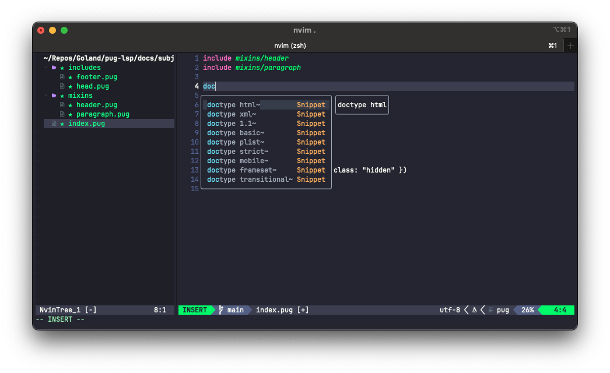

### Keywords suggestions

#### `case .. when .. default`

Pug-LSP simply follows [Pug's implementation](https://pugjs.org/language/case.html)


_Note_ [Case Fall Through](https://pugjs.org/language/case.html#case-fall-through)

> You can use fall through, just as you would in a JavaScript switch statement.
>
> The difference, however, is a fall through in JavaScript happens whenever a break statement is not explicitly included; 
> in Pug, it only happens when a block is completely missing.

If you would like to not output anything in a specific case, add an explicit unbuffered break snippet: `- break`


#### `if .. else`

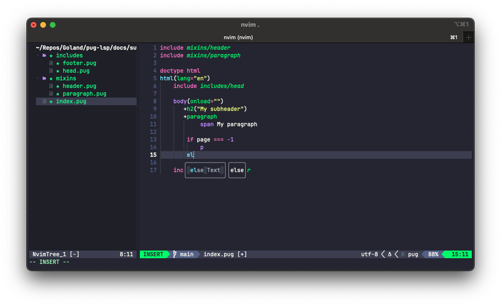


### Hover reference

See full desciption on hover!
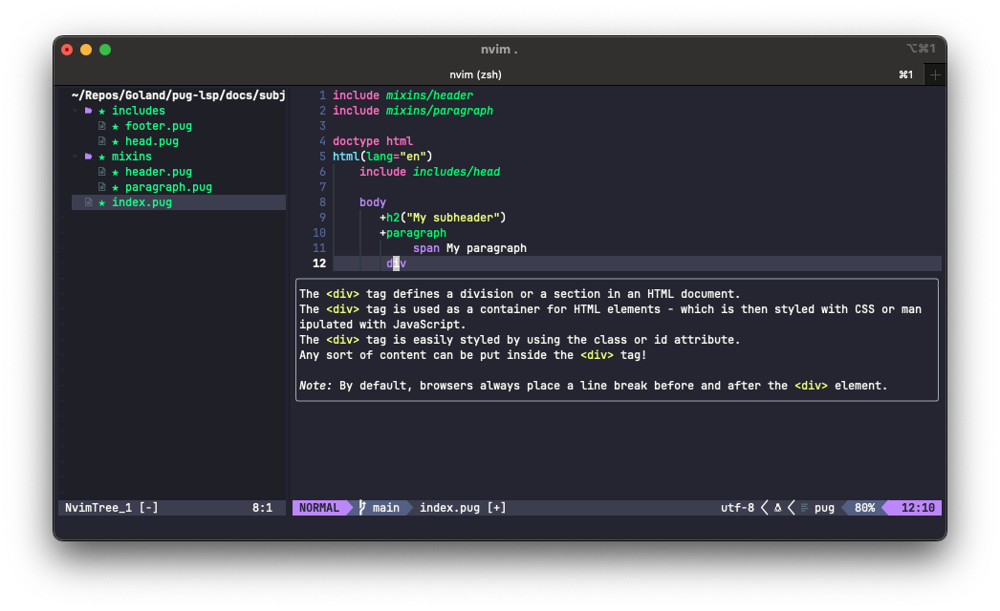

### Diagnostics

#### Include 

Check if filepath is valid
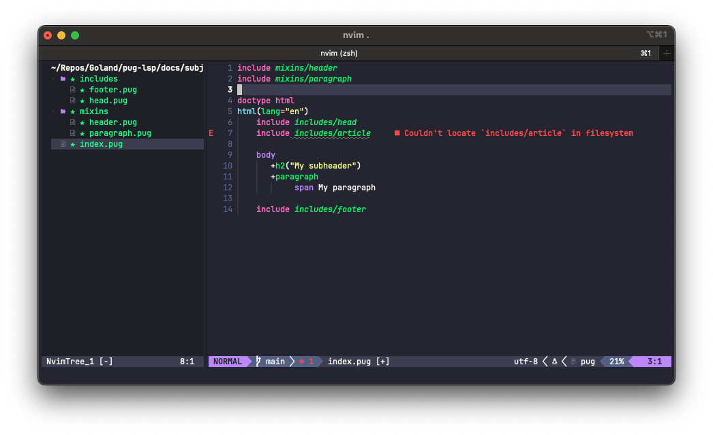

#### Mixins

1. Check if mixin exists (_or included_)
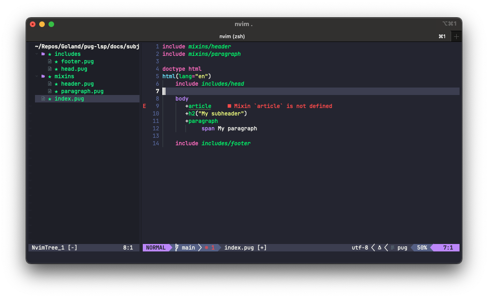

2. Check if desired arguments passed
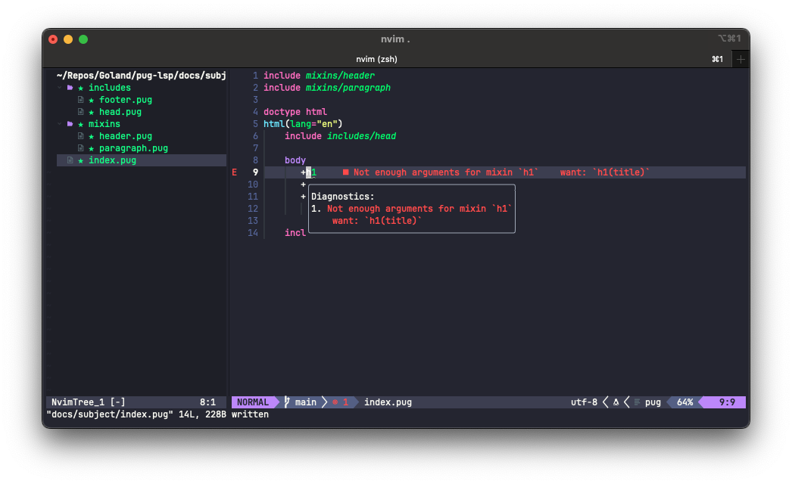


## Thanks

 - [zealot128/tree-sitter-pug](https://github.com/zealot128/tree-sitter-pug)


----

[](https://ko-fi.com/S6S1UZ9P7)

